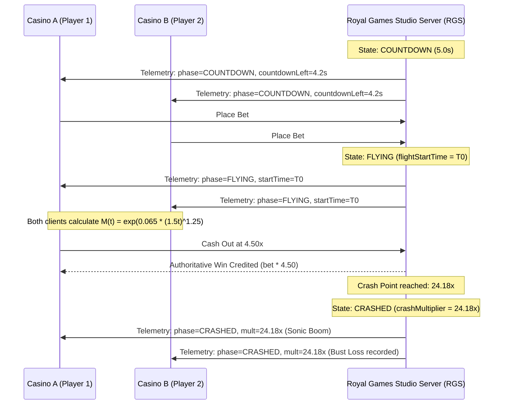

# HTML5 Casino Game Studio — AI Editor & Master Studio Instructions

## 1. Project Goal

Build and maintain a world-class **HTML5 Casino Game Studio & Remote Gaming Server (RGS)** built on **Next.js**, **TypeScript**, **Canvas/WebGL**, and **Web Audio API**.

The studio contains **10 original, proprietary HTML5 casino titles** featuring high-performance physics, smooth 60FPS animations, provably fair mathematics, authoritative backend synchronization, and B2B REST/Webhook integration capabilities.

### Studio Core Values:
- **100% Proprietary Presentation**: Original names, original vector art, original sound synthesis, and original math engines.
- **Enterprise B2B RGS Standards**: Authoritative server validation, zero client-side trust, instant webhook settlements, and global multiplayer synchronization.
- **7-Figure UI/UX Excellence**: Cinematic dark glassmorphism, responsive mobile-first viewports, real-time live telemetry, and silky smooth 60FPS canvas rendering.

---

## 2. The 10 Active Proprietary Studio Games

| # | Game Name | Game UID | Category | RTP | Max Multiplier | Key Mechanic & Presentation |
|---|---|---|---|---|---|---|
| 1 | **Sky Rush** | `royal_skyrush` | Crash / Multiplier | 97.5% | 1,000x | **Global Synchronized Multiplayer Crash Jet**. 24/7 continuous server loop, dual bet panels, passenger ejection parachute jumps, auto-cashout, and sonic boom explosion bust. |
| 2 | **Tiger Trail** | `royal_tigertrail` | Step / Cashout | 98.0% | 500x | **Jungle River Expedition**. 10-step ancient stone path with climbing river multipliers and crumbling river traps. Step forward or cash out at any stone. |
| 3 | **Bomb Grid** | `royal_bombgrid` | Originals / Mines | 98.5% | 500x | **5x5 Laser Energy Crystal Minefield**. Uncover safe glowing crystals across a 25-tile grid with selectable bomb count (1 to 24). |
| 4 | **Drop X** | `royal_dropx` | Physics / Plinko | 98.2% | 1,000x | **60FPS Multi-Pin Physics Plinko**. Real-time gravity simulation with selectable 8–16 pin rows and Low / Medium / High risk bucket payout distributions. |
| 5 | **Cricket Blast** | `royal_cricketblast` | Crash / Sports | 97.6% | 500x | **Global Synchronized Night Stadium Crash**. Batter hits a super-six ball into the floodlit night sky as the multiplier escalates until boundary catch out. |
| 6 | **Infinity X** | `royal_infinityx` | Quantum / Limbo | 98.8% | 10,000x | **Quantum Hyperspace Fast Target Limbo**. Instant probability multiplier generator with real-time target win odds calculation. |
| 7 | **Treasure Tower** | `royal_treasuretower` | Tower / Risk Step | 98.0% | 500x | **8-Floor Temple Pyramid Risk Stepper**. Ascend through 8 vertical temple floors by picking safe stone doors while avoiding hidden crumble traps. |
| 8 | **Dice X** | `royal_dicex` | Probability / Table | 99.0% | 990x | **3D Isometric Probability Dice**. Interactive Roll Under / Over threshold slider with instant win chance and payout multiplier calculation. |
| 9 | **Card Climb** | `royal_cardclimb` | Table / Cards | 98.3% | 120x | **3D Royal Hi-Lo Felt Table**. Predict whether the next sequential royal card is Higher or Lower to build multiplier streaks. |
| 10 | **Lucky Wheel X** | `royal_luckywheel` | Wheel / Fortune | 97.0% | 100x | **60FPS Dynamic Multiplier Sector Wheel**. Dynamic spinning sector wheel with Low/Med/High risk wheel configurations. |

---

## 3. Global Multiplayer Synchronized Crash Engine

For multiplayer crash games (**Sky Rush** & **Cricket Blast**), the studio uses a **Centralized 24/7 Authoritative Server Clock Engine** (`lib/serverCrashEngine.ts`):



### Key Multiplier Specifications:
- **Synchronized Telemetry Endpoint**: `GET /api/studio/multiplayer/state?game=[gameUid]`
- **Global Ascent Formula**: $M(t) = e^{0.065 \cdot (1.5t)^{1.25}}$ where $t$ is seconds elapsed since `flightStartTime`.
- **Provably Fair Crash Generation**: Pareto inverse distribution with 3.5% instant crash house edge ensuring mathematical 97.5% RTP.

---

## 4. Enterprise 7-Figure B2B Admin Dashboard (`/admin`)

The studio backoffice features a **Fixed Left-Sidebar Enterprise Dashboard Layout**:

```text
┌───────────────────────────┬─────────────────────────────────────────────────────────────────┐
│ 👑 ROYAL GAMES STUDIO     │ 🧭 RGS Admin > Round Audit Stream Ledger      🟢 Live Sync (4s) │
│ RGS Engine • ONLINE (Ping)│ ────────────────────────────────────────────────────────────────│
│ 10 Clients • 10 Games     │                                                                 │
├───────────────────────────┤                                                                 │
│ OPERATOR MANAGEMENT       │                                                                 │
│ 🔑 B2B Clients & Keys     │                      ACTIVE CONTENT AREA                        │
│ 💳 Deposit Approvals (2)  │             (Client Management / Round Audit Table /            │
│ 📈 Studio Overview        │                   Deposit Review / API Docs)                    │
│                           │                                                                 │
│ ENGINE & AUDIT STREAM     │                                                                 │
│ 📑 Round Audit Ledger LIVE│                                                                 │
│ 🌐 API Integration Docs   │                                                                 │
│                           │                                                                 │
│ EXTERNAL LINK             │                                                                 │
│ 🎮 Live Game Suite        │                                                                 │
├───────────────────────────┤                                                                 │
│ 👤 admin (Superadmin) 🚪  │                                                                 │
└───────────────────────────┴─────────────────────────────────────────────────────────────────┘
```

### Dashboard Capabilities:
- **Real-Time 4s Background Telemetry**: Auto-polls `GET /api/admin/rounds` and live data streams.
- **B2B Client & API Key Management**: Instant generation of `rgs_live_...` API keys, secret tokens, and IP whitelist firewalls.
- **Prepaid GGR Balance Adjuster**: Credit/debit operator prepaid wallets with audit ledger trail.
- **Deposit Approval Workflow**: Review operator recharge requests with 1-click Approve or Reject modals.
- **Live B2B API Playground**: Test `/api/v1/launch` sessions directly in the browser with live JSON responses.

---

## 5. Authoritative Round Settlement & Webhook Engine

### Round Resolution Endpoint: `POST /api/studio/round`
Transmitted whenever a player completes a round (Win or Loss):
```json
{
  "sessionId": "sess_live_abc123",
  "sessionToken": "jwt_token_here",
  "gameUid": "royal_skyrush",
  "betAmount": 100.00,
  "winAmount": 250.00,
  "multiplier": 2.50,
  "currentBalance": 1000.00
}
```

### Server-Side Settlement Flow:
1. **Locates Game Session**: Finds matching `GameSession` in database.
2. **Authoritative Balance Update**: `newBalance = Math.max(0, session.balance - betAmount + winAmount)`.
3. **GGR Revenue Share Calculation**: `ggrFee = (bet - win > 0) ? (bet - win) * (operator.ggrRate / 100) : 0`.
4. **Database Persistence**: Creates immutable `GameRound` entry in `db.gameRound` with unique `serialNumber`.
5. **Instant Webhook Callback Dispatch**: Posts payload to client casino `callbackUrl`:
```json
{
  "game_id": 88801,
  "game_uid": "royal_skyrush",
  "game_round": "SN_ROYAL_1787428237228_4422",
  "member_account": "player_12345",
  "bet_amount": 100.00,
  "win_amount": 250.00,
  "credit_amount": 1150.00,
  "serial_number": "SN_ROYAL_1787428237228_4422",
  "game_name": "Sky Rush",
  "timestamp": 1787428237228
}
```

---

## 6. B2B REST API Specifications

### 1. Launch Game Session: `POST /api/v1/launch`
**Headers**: `x-api-key: rgs_live_...` or `Authorization: Bearer rgs_live_...`  
**Body**:
```json
{
  "user_id": "player_99182",
  "game_uid": "royal_skyrush",
  "currency": "INR",
  "balance": 5000.00,
  "callback_url": "https://client-casino.com/api/callback",
  "return_url": "https://client-casino.com/lobby"
}
```
**Response**:
```json
{
  "status": 1,
  "code": 0,
  "msg": "Session created successfully",
  "data": {
    "launch_url": "http://localhost:3002/play/sess_abc123?token=jwt...&game=royal_skyrush&returnUrl=...",
    "session_id": "sess_abc123",
    "token": "jwt..."
  }
}
```

### 2. Live Games Catalog: `GET /api/v1/games`
Returns all 10 active titles with official vector SVG thumbnails (`/games/*.svg`).

---

## 7. Sound Design & Audio Synthesis

All games utilize the centralized sound synthesizer (`lib/soundFx.ts`) utilizing Web Audio API:
- `sound.playChipBet()`: Crisp tactile mechanical bet sound
- `sound.startJetEngine()`: Low-frequency rising jet turbine drone
- `sound.updateJetPitch(multiplier)`: Dynamic frequency pitch modulation during ascent
- `sound.playSonicBoom()`: Sub-bass resonant explosion on crash/caught
- `sound.playWin()`: Ascending melodic chime
- `sound.playCoinFlip()`: Metallic spinning coin sound
- `sound.playLoss()`: Gentle low dissonance cue

---

## 8. Directory & Component Mapping

```text
royalgames/
├── app/
│   ├── admin/page.tsx               # Enterprise 7-Figure Sidebar Admin Portal
│   ├── play/[sessionId]/page.tsx    # Responsive Play Arena & Game Switcher
│   ├── page.tsx                     # Studio Showcase Landing Page
│   └── api/
│       ├── v1/                      # B2B External Integrations (launch, games, ggr-balance)
│       ├── admin/                   # Backoffice Endpoints (clients, stats, rounds, deposits)
│       └── studio/
│           ├── multiplayer/state/   # Real-time Global Multiplayer Synchronizer
│           ├── round/               # Authoritative Round Settlement Engine
│           └── session/             # Player Session & Balance Verification
├── components/
│   └── games/                       # 10 Active HTML5 Game Components & Canvases
│       ├── SkyRushGame.tsx          # Sky Rush Component
│       ├── SkyRushCanvas.tsx        # Sky Rush 60FPS Canvas
│       ├── TigerTrailGame.tsx       # Tiger Trail Component
│       ├── BombGridGame.tsx         # Bomb Grid Component
│       ├── DropXGame.tsx            # Drop X Plinko Component
│       ├── CricketBlastGame.tsx     # Cricket Blast Component
│       ├── CricketBlastCanvas.tsx   # Cricket Blast Canvas
│       ├── InfinityXGame.tsx        # Infinity X Component
│       ├── TreasureTowerGame.tsx    # Treasure Tower Component
│       ├── DiceXGame.tsx            # Dice X Component
│       ├── CardClimbGame.tsx        # Card Climb Component
│       └── LuckyWheelGame.tsx       # Lucky Wheel X Component
├── lib/
│   ├── gamesCatalog.ts              # Canonical STUDIO_GAMES 10-Title Catalog
│   ├── serverCrashEngine.ts         # Authoritative Global Crash Engine State Machine
│   ├── soundFx.ts                   # Web Audio API Sound Synthesizer
│   ├── webhook.ts                   # Idempotent Webhook Dispatcher
│   └── db.ts                        # Prisma Database Client
└── public/
    └── games/                       # High-Definition SVG Vector Banners
        ├── royal_skyrush.svg
        ├── royal_tigertrail.svg
        ├── royal_bombgrid.svg
        ├── royal_dropx.svg
        ├── royal_cricketblast.svg
        ├── royal_infinityx.svg
        ├── royal_treasuretower.svg
        ├── royal_dicex.svg
        ├── royal_cardclimb.svg
        └── royal_luckywheel.svg
```
